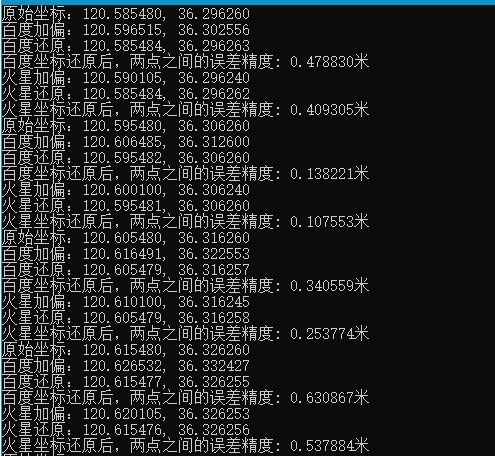

# CoordinateConverter
百度,国测局,WGS84坐标系坐标转换器  
转换误差最大在2.5米以内

	/*
	* Comments: 将当前坐标转换为国测局02系坐标(火星坐标)
	* Param aX: 待转换的经度
	* Param aY: 待转换的纬度
	* Param aType: 待转换的经纬度所属坐标系
	* Param aCoordinate: [输出] 转换后的GCJ02系坐标
	* @Return void
	*/
	void Main_ConvertGCJ02(double aX, double aY, CoordinateSystemType aType, MainCoordinate *aCoordinate);

	/*
	* Comments: 将当前坐标转换为百度系坐标
	* Param aX: 待转换的经度
	* Param aY: 待转换的纬度
	* Param aType: 待转换的经纬度所属坐标系
	* Param aCoordinate: [输出] 转换后的百度系坐标
	* @Return void
	*/
	void Main_ConvertBD09(double aX, double aY, CoordinateSystemType aType, MainCoordinate *aCoordinate);

	/*
	* Comments: 将当前坐标转换为WGS84国际通用坐标
	* Param aX: 待转换的经度
	* Param aY: 待转换的纬度
	* Param aType: 待转换的经纬度所属坐标系
	* Param aCoordinate: [输出] 转换后的WGS84系坐标
	* @Return void
	*/
	void Main_ConvertWGS84(double aX, double aY, CoordinateSystemType aType, MainCoordinate *aCoordinate);

	/*
	* Comments: 获取两个经纬度之间的距离(m)
	* Param :
	* @Return void
	*/
	double Main_GetDistance(double aX1, double aY1, double aX2, double aY2);

### 联系方式
QQ: 11783566

